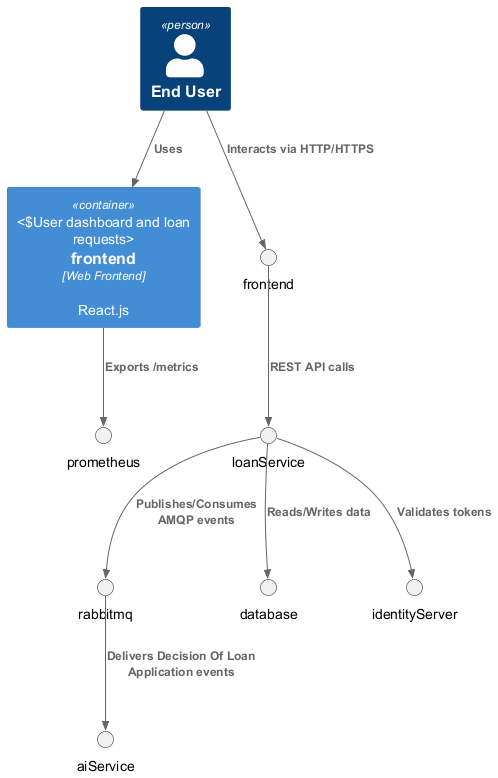

# Decision Engine

A suite of microservices for credit evaluation and loan management, built with FastAPI, scikit-learn, ASP .NET Core + Duende IdentityServer, and deployed on Kubernetes.

---

## 📦 Contents

* **ai-service/**

  * Inference service exposing `/predict`
  * Trains a RandomForest model for **approve | pending | reject** decisions
* **identity-server/**

  * Duende IdentityServer + ASP .NET Identity for user management and OAuth2/OIDC
* **credit-bureau/**

  * (Optional) Client microservice querying a “Credit Bureau API”
* **loan-service/**

  * ASP .NET Core service for loan request management
  * Listens to `UserRegisteredEvent` via RabbitMQ and persists `Customer`
  * Exposes secured endpoints under `/loans`
* **k8s/**

  * Manifests for Secrets, ConfigMaps, Deployments, Services, Ingress, StatefulSet (SQL Server), Jobs, CRD Queues, etc.

---

## 🚀 Architecture



This C4 diagram shows the Context and Container views of the Decision Engine ecosystem:

* **Users** interact through the Web Frontend (
  React.js
  ).
* **Loan Service** (.NET 7 + MassTransit) handles loan requests and consumes events from RabbitMQ.
* **Identity Server** (Duende IdentityServer) provides authentication & authorization.
* **AI Service** (Python + FastAPI) processes audio summaries and risk scoring.
* **RabbitMQ** acts as the message bus with retry and DLQ support.
* **Loan Database** (MongoDB/SQL Server) persists customers and loans.
* **Prometheus** collects metrics from all services.

---

## 🔄 Latest Changes

* **Retry & Dead-Letter Queue**

  * Configured MassTransit to use exponential retry (3 attempts, 1s–10s) for `UserRegisteredConsumer`.
  * Bound failed messages to `user-registered-queue-dlq` dead-letter queue in RabbitMQ.
  * Updated Kubernetes manifests to declare `user-registered-queue` and `user-registered-queue-dlq` CRD queues.

---

## ⚙️ Prerequisites

* [Docker](https://www.docker.com/)
* [kubectl](https://kubernetes.io/docs/tasks/tools/)
* Minikube / GKE / AKS / EKS
* .NET 9 SDK (for IdentityServer & Loan-Service)
* Python 3.10+ (for ai-service)

---

## 🛠️ Local Setup

1. **Clone the repo**

   ```bash
   git clone https://github.com/your-user/decision-engine.git
   cd decision-engine
   ```

2. **Run SQL Server locally**

   ```bash
   docker run -e "ACCEPT_EULA=Y" -e "SA_PASSWORD=YourStrong@Passw0rd" \
     -p 1433:1433 --name mssql-local -d mcr.microsoft.com/mssql/server:2019-latest
   ```

3. **Build & run AI-Service**

   ```bash
   cd ai-service
   pip install -r requirements.txt
   python training.py         # train model
   uvicorn app:app --reload
   ```

4. **Run IdentityServer**

   ```bash
   cd identity-server
   dotnet run
   ```

5. **Run Loan-Service**

   ```bash
   cd loan-service/src/LoanService.Api
   dotnet run
   ```

---

## 📦 Docker & Kubernetes

1. **Build Docker images**

   ```bash
   # AI-Service
   docker build -t yourrepo/ai-inference:latest ai-service/

   # IdentityServer
   docker build -t yourrepo/identity-server:latest identity-server/

   # Loan-Service
   docker build -t yourrepo/loan-service:latest loan-service/src/
   ```

2. **Push images to registry**

   ```bash
   docker push yourrepo/ai-inference:latest
   docker push yourrepo/identity-server:latest
   docker push yourrepo/loan-service:latest
   ```

3. **Deploy to Kubernetes**

   ```bash
   # Ensure namespace
   kubectl create ns decision-engine-dev || true
   kubectl config set-context --current --namespace=decision-engine-dev

   # Apply all k8s manifests
   kubectl apply -f k8s/
   ```

4. **Verify deployments**

   ```bash
   kubectl get all
   kubectl logs deployment/identity-server
   kubectl logs deployment/loan-service
   kubectl port-forward svc/ai-inference 8000:8000
   ```

---

## 🔍 Testing

* **AI-Service Predict**

  ```bash
  curl http://localhost:8000/predict \
    -H "Content-Type: application/json" \
    -d '{"salary":5000000,"age":30,"credit_score":700,"total_debt":1000000,"payment_history":[{"month":"2025-06","status":"on_time"}]}'
  ```

* **IdentityServer Metadata**
  Visit `http://identity-server.local/.well-known/openid-configuration`

* **Loan-Service Endpoints**

  ```bash
  # list all loans
  curl -H "Authorization: Bearer <token>" http://loan-service.local/loans

  # get by id
  curl -H "Authorization: Bearer <token>" http://loan-service.local/loans/<loanId>
  ```

---

## 🎯 Best Practices

* Store secrets in **Kubernetes Secrets**
* Use **Helm** for parameterized templating
* Integrate **CI/CD** pipelines
* Add **unit** & **integration tests**
* Monitor with **Prometheus** & **Grafana**

---

## 🛣 Roadmap

* Enhance **Loan-Service** with more business rules
* Implement **front-end** (React + Tailwind)
* Add **RabbitMQ** orchestration for multi-step workflows
* Improve security, performance and observability

---

## ⚖️ License

MIT © Cristian Mendoza

## 🔗 LinkedIn

[](https://www.linkedin.com/in/ctj01/)
